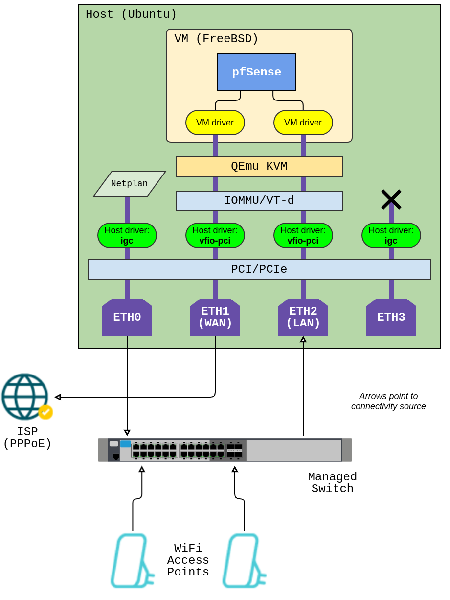

# soft-router

Home router setup and associated server hardware and software configurations.

## Outline

We want to run pfSense within a QEmu VM on the N100 Computer running Ubuntu
server.

QEmu VM is a very lightweight system, that allows easy pass-through of the host
CPU and it's features, together with PCI devices. In our case, we wish to
pass-through 2 of the 2.5G I226-V LAN devices to be owned and managed within the
VM running pfSense.

Furthermore, the host Ubuntu server gives us control over changes we would like
to make to the VM.

Containers were considered, however since pfSense runs on a different kernel,
QEmu VM was selected.

## Hardware

Hardware used from AliExpress:

- 12th Gen Intel N100 Computer with 4 x 2.5G I226-V LAN NVMe Industrial Fanless
  Mini PC (16GB Ram 256GB NVMe)
- HORACO 2.5G Managed Switch 8 Port 2.5GBASE-T Fanless

## Architecture

Note that both ETH0 (host comms) and ETH2 (pfSense LAN) from our N100 Computer
are both connected to the managed switch. That is, pfSense runs on the host
within a VM using ETH1 (WAN) and ETH2 (LAN) as pass-through PCI devices, and
provide a network for the host to connect via the same managed switch. This
allows us to access the host server via our WiFi access points for future
configuration and maintenance.

## BIOS Setup

Ensure you enable Intel Virtualization (VT-x) and Direct I/O (VT-d) from the
BIOS.

## Server Setup

Configuring the N100 Computer.

### Install Host Ubuntu Server

Installed Ubuntu 24.04 onto the N100 Computer.

### User Groups and Limits

We use the Linux Kernel Virtual Machine (KVM) virtualization solution to run
the QEmu VM seemlessly at close to metal speeds. To do this, we need to add our
user to the 'kvm' group as follows:

    sudo adduser `id -un` kvm

Increase the resource limits for the users by editing
'/etc/security/limits.conf' and append:

    <user-id> soft memlock 20000000
    <user-id> hard memlock 20000000

### Enable Linux IOMMU Support

Our setup uses the Linux Input-Output Memory Management Unit (IOMMU), which
translates device virtual addresses to physical address. We use this to
pass-through our ETH1 and ETH2 LAN devices from our host Linux computer to the
QEmu VM.

Edit `/etc/default/grub` and navigate to
`GRUB_CMDLINE_LINUX_DEFAULT=""` and make the following changes:

    GRUB_CMDLINE_LINUX_DEFAULT="intel_iommu=on kvm.ignore_msrs=1"

For it to take effect run:

    sudo grub-mkconfig -o /boot/grub/grub.cfg

After rebooting the server, check that Linux IOMMU Support is enabled by
running:

    sudo dmesg | grep -i -e DMAR -e IOMMU

You should see `[    --------] DMAR: IOMMU enabled` in the output dump.

## Enable Linux Kernel Module VFIO

For the ETH1 and ETH2 LAN devices we wish to pass-through to our QEmu VM, we
need the host Linux Kernel to assign the Virtual Function I/O (VFIO) driver to
these devices instead of the default driver, which is normally used to operate
these devices on the host system.

For example, if you run the command `lspci -nnk` you will see
`Kernel driver in use: igc` for ETH1 and ETH2 (it was igc for the particular
hardware used in this example).

Copy `ubuntu/etc/modules-load.d/vfio-pci.conf` to `/etc/modules-load.d/` on your
server and run:

    sudo chmod 644 /etc/modules-load.d/vfio-pci.conf

## PCI Addresses of I226-V LAN Devices

Figure out the PCI device addresses of the two I226-V LAN devices you wish to
use with pfSense. To do this, you use commands like `lspci -nnk` and
`lshw -short -c network`. In my case these address were `0000:02:00.0` for ETH1
and `0000:03:00.0` ETH2, and you will see these addressed used throughout this
document and scripts provided in this repository. Change these to match your
specific PCI device addresses.

## Make Linux Kernel use VFIO Module for I226-V LAN Devices

Copy `ubuntu/etc/udev/rules.d/10-qemu.rules` to `/etc/udev/rules.d/` on your
server and edit the file to change `0000:02:00.0` and `0000:03:00.0` to the PCI
addresses, and change `8086 125c` to the vendor-id and device-id of your
devices.

Then apply by running:

    sudo udevadm control --reload-rules
    sudo udevadm trigger

Running command `lspci -nnk` will now show `Kernel driver in use: vfio-pci` for
your assigned devices.

## Create pfSense disk image

After all the host server setup is complete, ensure to reboot the server for all
to take effect before proceeding here.

> [!WARNING]
> The initial pfSense setup steps must be done over SSH session using a desktop
> computer, and NOT on the host computer using a keyboard/monitor plugged
> directly. The reason for this is because QEmu must open a guest window popup,
> which gives you the access needed to perform the initial pfSense setup.
> Of course this is assuming you have installed a server version of Ubuntu; if
> you have installed a desktop version (not recommended) then this note could be
> disregarded.
> To clarify further, the `qemu-system-x86_64` startup command below does NOT
> have the option `-nographic` specified, however the init.d startup script
> does! During setup we need the graphic window of QEmu and during server
> operations thereafter, we will not.

First make a 32G disk image:

    dd if=/dev/zero of=disk-raw iflag=fullblock bs=1G count=32

Download your copy of `netgate-installer-amd64.iso` (pfSense installer).

Then start QEmu mounting your disk image, ISO installer file and LAN
path-through devices:

    qemu-system-x86_64 \
        -enable-kvm \
        -cpu host \
        -smp 4 \
        -k en-us \
        -cdrom netgate-installer-amd64.iso \
        -drive id=disk,file=<path-to-image>/disk-raw,format=raw,if=none \
        -device ahci,id=ahci \
        -device ide-hd,drive=disk,bus=ahci.1 \
        -boot d \
        -device vfio-pci,host=0000:02:00.0 \
        -device vfio-pci,host=0000:03:00.0 \
        -m size=4096

## pfSense Setup

The only pfSense setup that is compulsory here is to make sure you chose your
ETH1 and ETH2 to align with your WAM (Ethernet cable from your ISP) and your
LAN (Ethernet cable to your 8x port managed switch).

Then you will connect all your household Ethernet devices to your switch,
including your WiFi devices.

A quick note on WiFi devices, setup all of your WiFi devices as Access Point
only mode. It is also nice to setup the exact same Network Name (SSID) and
password for all of your WiFi devices, just make sure you chose a different
channel for each if you have multiple access points.

It could be a good idea to also use command `nmcli d wifi` to check nearby WiFi
signals and to check what channels they are using, so that you pick a different
channel to minimize clashing.

## Make pfSense Persistent

Copy `ubuntu/etc/init.d/qemu-pfsense` to `/etc/init.d/` path on your server and
edit to change the `<user-id>` and `<path-to-image>` on the following lines:

    exec sudo -H -u <user-id> bash -c 'qemu-system-x86_64

and

    -drive id=disk,file=<path-to-image>/disk-raw,format=raw,if=none

Then for it to take effect run:

    sudo chmod a+x /etc/init.d/qemu-pfsense
    sudo update-rc.d qemu-pfsense defaults
    sudo update-rc.d qemu-pfsense enable

You may need to reboot at this stage. When your system comes back up check
`/var/log/syslog` to see if qemu instances started without issues. You can also
use 'htop' to check the active running processes. In this example, with the N100
running QEmu with 4 cores, `htop` shows 4 instances of `qemu-system-x86_64`.

## Improve Booting Up Time

Copy `ubuntu/etc/netplan/99_config.yaml` to `/etc/netplan/` path on your server
and run:

    sudo chmod 600 ubuntu/etc/netplan/99_config.yaml
    sudo netplan apply

This added the `optional: true` to all but the first ETH0 device, which speeds
up the boot time.

You can check the booting up time analysis with the command:

    systemd-analyze blame

Before this change, the main slowness was coming from:

    systemd-networkd-wait-online.service too slow

## Cockpit

To make monitoring of your server easier install
[Cockpit](https://cockpit-project.org/):

    sudo apt-get install cockpit

Start and enable Cockpit:

    sudo systemctl enable --now cockpit.socket

Then browse to _https://server:9090/_

Different Cockpit components can be installed, for example Performance Co-Pilot:

    sudo apt install cockpit-pcp

Then restart Cockpit:

    sudo systemctl restart --now cockpit.socket

